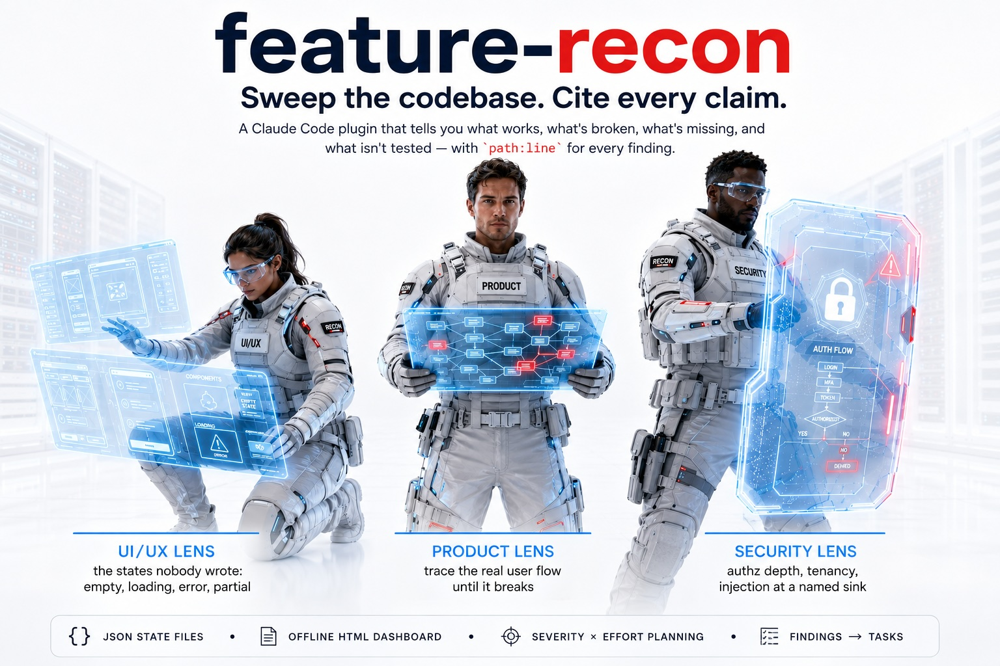
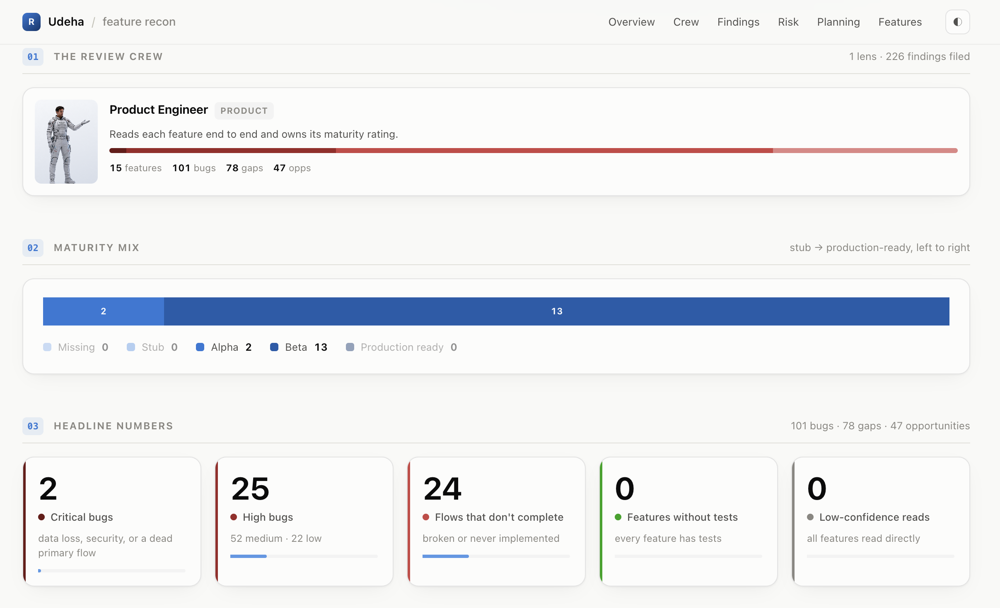

# Claude Code Feature-Recon Plugin





A Claude Code plugin that sweeps a codebase feature by feature and tells you, with citations, what
works, what's broken, what's missing and what isn't tested — as JSON state files plus a
self-contained HTML dashboard.

It is **reconnaissance, not ground truth**: a static read of the code that cites `path:line` for
every claim and declares what it could not inspect. Read-only — it never changes your code.

## Install

```sh
/plugin marketplace add https://github.com/iSerter/claude-feature-recon
/plugin install feature-recon
```

A local checkout works too — pass its path instead of the URL.

**Requirements:** `git` for the commit stamp, and **either `python3` (3.6+) or `node` (14+)** to
build the dashboard — whichever you already have. `build_report.sh` detects one and uses it; the
Python and JavaScript builders are ports of each other and emit byte-identical reports, both
standard-library only, nothing to install. Force one with `FEATURE_RECON_RUNTIME=node`. With
neither runtime the sweep still produces the JSON state files; only the HTML render is skipped.

The three **browser** commands need more, because they drive a real application:

| Needed by | Dependency |
|---|---|
| `/identify-user-flows`, `/test-user-flows`, `/create-demo-videos` | `node` 20+ and Playwright with Chromium |
| `/create-demo-videos` | `ffmpeg` + `ffprobe` |
| Narration (optional) | `GOOGLE_GENAI_API_KEY` or `GEMINI_API_KEY` — without it the videos render silent |

```sh
sh <plugin>/scripts/install-deps.sh             # report what is missing, install nothing
sh <plugin>/scripts/install-deps.sh --install   # install Playwright + Chromium into the plugin
```

Playwright is resolved from the plugin's own `node_modules` first and from the project being
reviewed second, so a repo that already uses Playwright needs no second copy. **None of this is
needed for `/feature-recon` or `/feature-tasks`** — the static sweep is unchanged.

## Use

Five commands. Two read the code, two drive the app, one turns findings into work.

```
/feature-recon                          # discover features, confirm the list, sweep everything
/feature-recon brands,campaigns,billing # sweep exactly these
/feature-recon --dir docs/state         # write somewhere other than docs/recon
/feature-recon --lens security          # add the security review lens
/feature-recon --lens all               # product + security + UI/UX (3 subagents per feature)
/feature-recon --sequential             # no subagent fan-out, one feature at a time

/feature-tasks                          # task files for critical+high bugs and P0/P1 gaps
/feature-tasks --severity critical      # only the critical ones
/feature-tasks --feature billing        # only one feature
/feature-tasks --lens security          # only what the security lens found
/feature-tasks --ids billing-bug-01,xc-02
/feature-tasks --out tasks/q3           # write somewhere other than tasks/
```

Then, against the running app:

```
/identify-user-flows                    # turn the report's flows into replayable recipes
/test-user-flows                        # run them in a real browser, file what breaks
/test-user-flows --feature billing      # re-run one feature's flows
/test-user-flows --headed --retries 1   # watch it, and retry failures once

/create-demo-videos                     # film the flows that passed, narrated
/create-demo-videos --feature billing   # one feature only
```

They also trigger on plain requests — "review the state of this project", "which features are
untested", "what should we fix first", "do the flows actually work", "make me a demo video".

## What you get

```
docs/recon/
  project.json                    rollup: verdict, cross-cutting findings, top findings, totals
  features/{slug}.json            one per feature: maturity, surface, coverage, flows, bugs, gaps, opps
  features/{slug}.security.json   only with --lens security
  features/{slug}.ux.json         only with --lens ux
  features/{slug}.e2e.json        only after /test-user-flows — see below
  recon-report.html               the dashboard — one file, opens by double-click, works offline
```

and, once the browser commands have run:

```
docs/recon/
  user-flows.json                 shared config (base URL, viewports, auth) + cross-feature flows
  flows/{slug}.json               one per feature: replayable recipes with real selectors
  e2e-test-results.json           what happened in the browser: per-step status, console, network
  e2e-artifacts/{flowId}/         failure screenshot, Playwright trace, video — only for what failed
  features/{slug}.e2e.json        what it meant: findings, cited to path:line, merged into the report
  demo-videos.json                scenes and narration
  videos/demo/{videoId}.mp4       one narrated video per feature
```

Each finding carries a stable id (`billing-bug-01`), an effort estimate, and the evidence it came
from, so consecutive runs diff cleanly in git and findings can be referenced in tickets.

## Review lenses

Every lens reviews one feature and writes its own file; the builder merges them into one feature in
the report, keeping the product lens's maturity rating and stamping each finding with the lens that
filed it. Re-running one lens leaves the others alone.

| Lens | Flag | Looks for | Cap per feature |
|---|---|---|---|
| Product engineer | default | Does this work for a real user, and what will page someone at 3am | 10 bugs, 8 gaps, 6 opps |
| Security | `--lens security` | The guard rather than the flow: authz depth, tenancy, injection at a named sink, SSRF, secrets, what leaks | 6 bugs, 5 gaps, 3 opps |
| UI/UX | `--lens ux` | The states nobody wrote: empty, loading, error, partial; destructive actions, keyboard and label defects (`a11y`) | 6 bugs, 5 gaps, 3 opps |
| Live browser | `/test-user-flows` | What actually happens when a real browser walks the flow | 6 bugs, 5 gaps, 3 opps |

**The product lens is the default and the specialists are opt-in, because the cost is multiplicative:**
three lenses across sixteen features is 48 subagents. Above ~20 agents the sweep states the number and
asks before spawning. Each specialist's file says what is *not* a finding for it — CVE-scanner noise
and unreachable theory for security, visual preference and copy rewriting for UI/UX — and each is told
that the product lens owns any defect it already filed at the same `path:line`, so the second pass goes
deeper instead of refiling.

Then `/feature-tasks` turns those findings into work:

```
tasks/
  00-index.md               ordered fix set, dependencies, what's cut, shared conventions
  01-{slug}.md              one task per root cause
```

Each task carries the finding ids it closes, the mechanism, cited `path:line` evidence, a
choke-point fix plan, named test cases, and the steps to update the report when it merges.

## The live-browser lens

Everything above is a code read. These three commands open the app.

```
/identify-user-flows  →  /test-user-flows  →  /create-demo-videos
   recipes                 results + findings      narrated mp4s
```

**1. Recipes.** The sweep already described each feature's flows in prose and said where each one
stops. `/identify-user-flows` turns those sentences into recipes a browser can replay — with real
selectors, read out of the page components, never invented. The UX and security lenses are told to
park anything needing a browser in `open_questions`; those parked probes are picked up here and
become flows.

Every flow must carry at least one `expect` step. A recipe of hovers and scrolls always passes and
therefore verifies nothing.

**2. Results, then findings.** `/test-user-flows` replays them and records what happened. It never
stops on a failure — the second failure is often what explains the first. Three outcomes, and the
distinction is the point:

| | Meaning | Whose problem |
|---|---|---|
| `passed` | Every assertion held | — |
| `failed` | An `expect` did not hold | The application |
| `blocked` | Never reached an assertion — stale selector, missing data, page would not open | The recipe or the environment |

Then an agent traces each failure back into the source and files it as an ordinary finding with a
`path:line`, so it lands in the same dashboard as everything else, tagged **Live browser**. A raw
timeout is not a bug report; the trace is the valuable part.

This is the only lens that can **retire** a finding. When a flow completes where the product lens
predicted a break, that finding was wrong and gets deleted — which no amount of re-reading the code
could have established.

**3. Videos.** `/create-demo-videos` films the flows that **passed**, one mp4 per feature: Playwright
drives the real UI with a visible cursor, Gemini TTS narrates each scene, ffmpeg cuts it together.
A flow that failed is never filmed — that would be a recording of a bug presented as a feature — and
the narration is bounded by what the report says actually works.

Both browser commands drive the app through the same interaction code, so the flow the suite
verified is the flow the camera films.

## How it works

1. **Orient** — one pass over the repo for stack, entrypoints, module layout, test locations.
2. **Discover** — derive the feature list from the product's own navigation, or from module/package
   dirs, or route groups. You confirm the list before anything expensive happens.
3. **Sweep** — one subagent per feature per lens, in batches, each writing its own JSON state file
   against `reference/report-spec.md`. The default lens works like a product engineer taking the
   feature over: trace the primary user flow through every layer until it breaks, then run a
   defect-pattern pass over what it traced — sibling divergence, failure paths, validation, tenancy,
   atomicity, data integrity, contract drift, the empty-account walkthrough. An inventory of what
   exists is not the deliverable.
4. **Roll up** — the verdict, the cross-cutting root causes, the ranked findings and a recommended
   fix sequence. Findings two lenses filed at the same line collapse to one here.
5. **Build** — `build_report.sh` validates every file, derives all counts (no hand arithmetic), and
   injects the data into the dashboard template.

## The dashboard

One file. No chart library, no CDN, no build step, no network access at runtime — every chart is
hand-rolled SVG and CSS, and the four lens portraits are inlined as `data:` URIs, so it opens by
double-click from any path and keeps working offline five years from now.

| Section | What it shows |
|---|---|
| Cover | Readiness gauge — two rings: production-ready inside, beta-or-better outside — over a crew line-up of the lenses that ran |
| The review crew | A card per lens: who it is, what it went looking for, and what it filed. With more than one lens, a stacked bar of each lens's bugs, gaps and opportunities |
| Maturity mix | One stacked bar across all features, stub → production-ready |
| Headline numbers | Critical bugs, high bugs, flows that don't complete, features without tests, low-confidence reads — each with its share of the whole |
| Verdict | The rollup's prose assessment |
| Risk map | Every feature as a bubble: maturity across, severity weight up, area is total findings. High and to the left is unfinished *and* dangerous |
| Bugs by feature | Stacked severity bars, ordered by severity weight — click a row to jump to that feature |
| What kind of broken | The same bugs cut by type — runtime error, logic, data integrity, security, performance, UX, a11y, regression — split by severity |
| User-flow health | Working / partial / broken / not implemented across the project, then per feature |
| Planning | Two heat grids: bugs by severity × effort, gaps & opportunities by priority × effort. The dark corner is where the work is pooled |
| Dependency map | Feature × feature matrix, plus which features are most depended on |
| Cross-cutting | One root cause spanning many features, with the affected features as jump links |
| Where to start | Biggest findings and the recommended fix sequence |
| Features | A card per feature — maturity, severity bar, counts — clicking one opens its full read |
| Every finding | Sticky filters (kind, severity, maturity, effort, priority, lens, full-text) over per-feature drill-downs with every cited `path:line` |
| Lens attribution | With more than one lens, each finding carries the lens that filed it — `product`, `security`, `ux` or `e2e` (*Live browser*) — and the filter bar gains a lens selector. A single-lens report shows one crew card and none of the rest |

Light and dark themes with a toggle that persists, deep links (`#feature-slug`), a sortable data
table, keyboard `/` to search, `Copy JSON`, and print styles.

**On the colors:** two hue families carry all the meaning — blue for magnitude and structure, red
for severity — each an ordinal ramp validated with the [`dataviz`](https://github.com/anthropics/skills)
palette validator in both light and dark (monotone lightness, adjacent ΔL ≥ 0.06, light end ≥ 2:1
against its surface). Severity and status are always named in text, never carried by color alone,
and the reserved status palette is used only for flow state. Which lens filed a finding is carried
by its portrait and its label — never by a hue, so no lens competes with severity for meaning.

## Rebuild the dashboard without re-running the sweep

```sh
B="sh <plugin>/skills/feature-recon/build_report.sh"

$B docs/recon                  # rebuild the dashboard from the JSON
$B --check docs/recon          # do all the state files still parse?
$B --which                     # which runtime would be used
$B --selftest                  # check the builder itself
```

Edit a JSON file by hand, rebuild, and the report follows. `ERROR` lines block the build; `WARN`
lines (unknown enum values, missing evidence, duplicate ids) are advisory. Exit 127 means no
runtime was found.

When the report directory sits inside its own repository, every `path:line` in `evidence[]` is
resolved against it and a citation that points at a file that isn't there — or past the end of one
that is — comes back as a `WARN`. It is the one automatic check on invented evidence. Copy the report
out of the repo and the check goes quiet, since nothing is left to resolve against.

## Files

| Path | What it is |
|---|---|
| `skills/feature-recon/SKILL.md` | the sweep procedure Claude follows |
| `skills/feature-recon/reference/report-spec.md` | the JSON contract, handed to each subagent |
| `skills/feature-recon/reference/lens-security.md` | the security lens's method and scope |
| `skills/feature-recon/reference/lens-ux.md` | the UI/UX lens's method and scope |
| `agents/recon-product-engineer.md` | the default review agent — stance, method, output contract |
| `agents/recon-security.md`, `agents/recon-ux.md` | the two opt-in specialist review agents |
| `skills/feature-recon/build_report.sh` | runtime picker — the only entry point anything calls |
| `skills/feature-recon/build_report.py` | validate + derive counts + render, Python (stdlib only) |
| `skills/feature-recon/build_report.js` | the same, JavaScript (Node builtins only) |
| `skills/feature-recon/template.html` | the dashboard template |
| `tests/parity.sh` | proves the two builders emit identical bytes |
| `skills/feature-tasks/SKILL.md` | the findings → tasks procedure |
| `skills/feature-tasks/templates/task.md` | one task file's shape |
| `skills/feature-tasks/templates/index.md` | the fix-set index's shape |
| `skills/identify-user-flows/SKILL.md` | the flows → recipes procedure |
| `skills/identify-user-flows/reference/flow-spec.md` | the recipe contract, handed to each subagent |
| `skills/test-user-flows/SKILL.md` | the run + triage procedure |
| `skills/test-user-flows/run_flows.mjs` | the Playwright runner (`--check` validates recipes offline) |
| `skills/create-demo-videos/SKILL.md` | the recording procedure |
| `skills/create-demo-videos/capture.mjs` · `tts.mjs` · `build.mjs` | record → narrate → cut |
| `agents/recon-test-engineer.md` | writes the recipes, and turns a run into findings |
| `agents/recon-feature-explainer.md` | writes the narration |
| `lib/flows.mjs` | the interaction vocabulary, auth and cursor — shared by both browser skills |
| `lib/common.mjs`, `lib/recipes.mjs`, `lib/preflight.mjs` | CLI parsing + content-hash cache, recipe loading, dependency checks |
| `scripts/install-deps.sh` | checks (and optionally installs) node / Playwright / ffmpeg |
| `commands/*.md` | the five slash-command entry points |

## Limits

- **The sweep is static.** `/feature-recon` reads code: no app runtime, no database, no test
  execution. Every finding it files is an inference about what the code would do.
- **The browser commands are the exception, and they are narrow.** `/test-user-flows` drives real
  flows as a normal signed-in user and reports what it saw. It does not fuzz, attack, or probe for
  vulnerabilities; it runs no existing test suite; it only knows about flows somebody wrote a recipe
  for. A feature with no flows is not a feature that works.
- A `blocked` flow tells you the recipe or the environment is wrong, not the feature. Recipes go
  stale as the UI changes and need maintaining like any other test.
- Snapshot, not a time series. Commit `docs/recon/` and `git log` is your history. The `videos/`,
  `e2e-artifacts/` and `.auth.json` outputs are large or sensitive — gitignore them.
- Costs scale with feature count **times lens count** — a 16-feature sweep is 16 subagents' worth of
  reading, and `--lens all` is 48. The specialists are default-off for exactly this reason.
- Chromium only. No visual-regression diffing, no captions on the videos.

## License

MIT — see [LICENSE.md](LICENSE.md).
