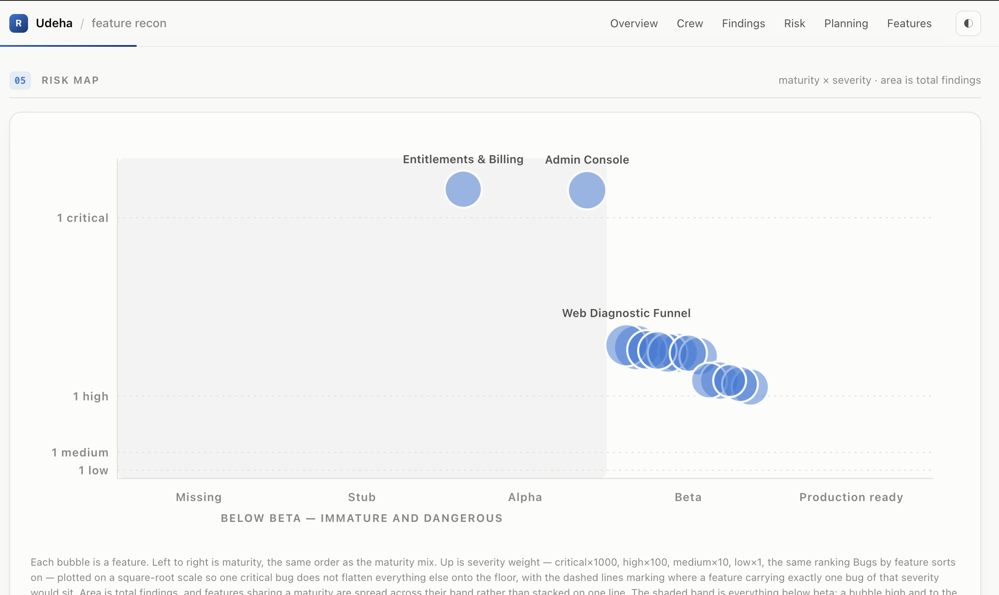
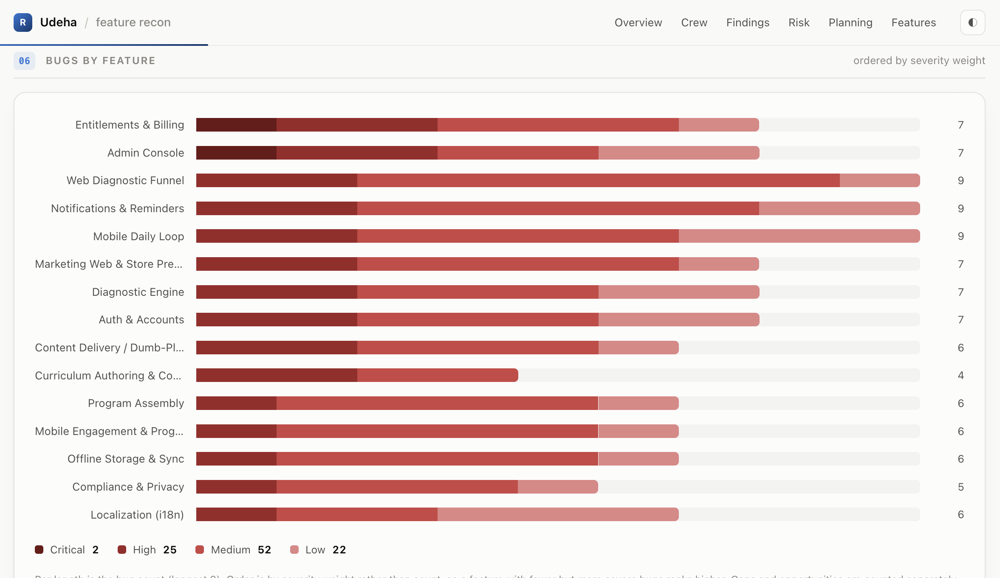
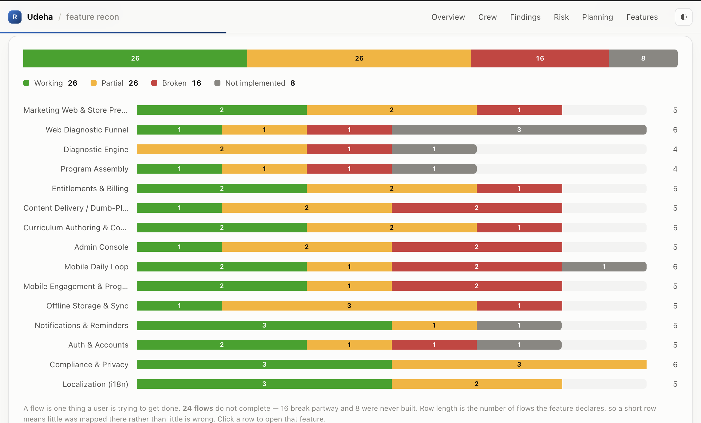
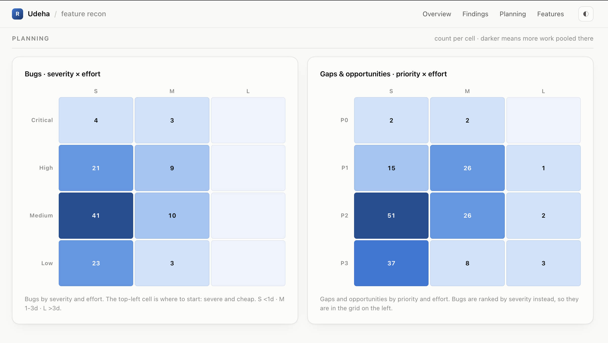
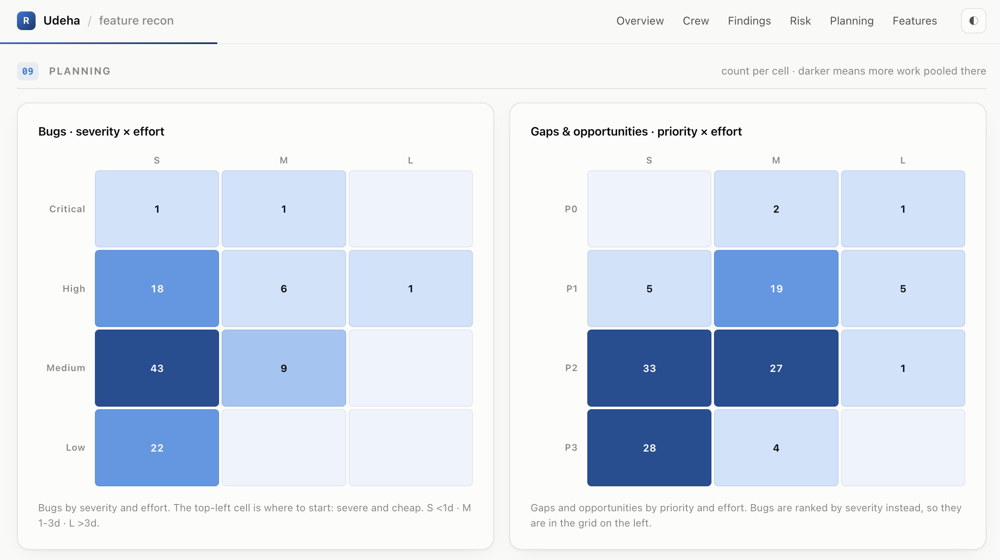
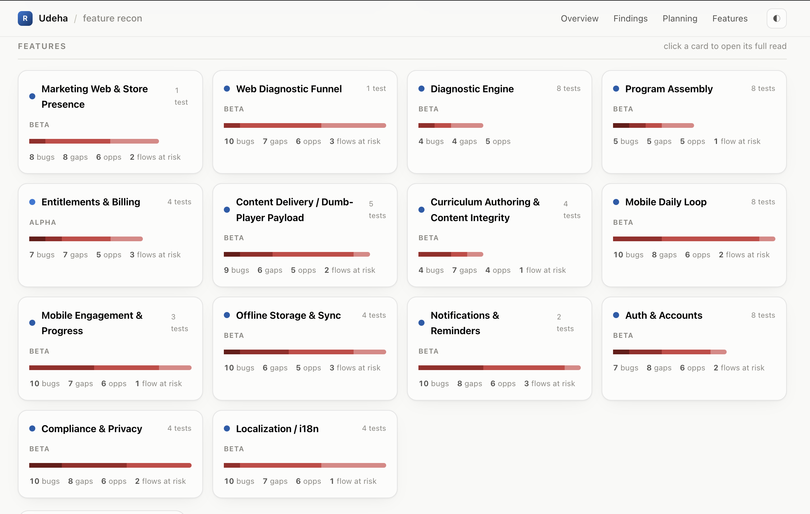

# Claude Code Feature-Recon Plugin
Challenge your codebase for production readiness.


**Is Your Codebase Production Ready? Feature-recon answers it in detail.**

Feature-recon sweeps a codebase feature by feature and tells you — with a `path:line` citation
behind every claim — what works, what's broken, what's missing, and what nobody tested. It ships
JSON state files you can diff in git and a self-contained HTML dashboard you open by double-click.

Then it goes further than a code read can: it drives your running app in a real browser, confirms
or retires its own findings, and films narrated demo videos of the flows that actually pass.

Read-only. It never changes your code.

```sh
/plugin marketplace add https://github.com/iSerter/claude-feature-recon
/plugin install feature-recon
```

```sh
/feature-recon      # discover features, confirm the list, sweep everything
```

Needs `git` and either `python3` or `node` — whichever you already have. Nothing to install.
Full details in [docs/installation.md](docs/installation.md).

---

## The report


One HTML file. No CDN, no build step, no network at runtime — every chart is hand-rolled SVG, so it
opens from any path and still works offline five years from now.

**The risk map answers the only question that matters on Monday morning:** which feature is both
unfinished *and* dangerous. Maturity across, severity weight up, bubble area is total findings.



Then it gets specific — severity stacked per feature, ordered by weight, every bar a jump link into
the full read with its cited evidence.



**Flow health separates "shipped" from "works".** Working, partial, broken, not implemented — across
the project and per feature.



**The planning grids show where the work is pooled** — bugs by severity × effort, gaps and
opportunities by priority × effort. Severe and cheap is the top-left cell, and that's where
`/feature-tasks` aims.



Fix things, re-run the sweep, and the grid moves with you. Same project after a work cycle —
critical bugs 7 → 2, high 30 → 25, while the medium backlog barely shifts. That's the shape of real
progress, and it's measurable between two commits.



Every feature also gets a card and a full drill-down — maturity, surface, coverage, flows, bugs,
gaps, opportunities.



Light and dark themes, deep links, sticky filters over every finding, keyboard `/` to search.
[Full section-by-section tour →](docs/dashboard.md)

---

## Five commands

| Command | What it does |
|---|---|
| `/feature-recon` | Sweep the codebase, build the report |
| `/feature-tasks` | Turn findings into ordered, evidence-cited task files |
| `/identify-user-flows` | Turn the report's flows into replayable browser recipes |
| `/test-user-flows` | Run them in a real browser, file what breaks |
| `/create-demo-videos` | Film the flows that passed, narrated |

They also trigger on plain requests — "review the state of this project", "which features are
untested", "what should we fix first", "do the flows actually work", "make me a demo video".

[Every flag →](docs/commands.md)

---

## Four reviewers, one report

The default lens works like a product engineer taking the feature over: trace the primary user flow
through every layer until it breaks, then run a defect-pattern pass over what it traced. An
inventory of what exists is not the deliverable.

| Lens | Flag | Looks for |
|---|---|---|
| Product engineer | default | Does this work for a real user, and what will page someone at 3am |
| Security | `--lens security` | The guard rather than the flow: authz depth, tenancy, injection, SSRF, secrets |
| UI/UX | `--lens ux` | The states nobody wrote: empty, loading, error, partial; destructive actions, `a11y` |
| Live browser | `/test-user-flows` | What actually happens when a real browser walks the flow |

Each lens writes its own file and the builder merges them, stamping every finding with who filed it.
Specialists are opt-in because cost is multiplicative — three lenses across sixteen features is 48
subagents. [How the lenses divide the work →](docs/lenses.md)

**Only the browser lens can retire a finding.** When a flow completes where the product lens
predicted a break, that finding was wrong and gets deleted — which no amount of re-reading the code
could have established. [The browser pipeline →](docs/browser-lens.md)

---

## Reconnaissance, not ground truth

The sweep is a static read of the code. Every finding is an inference about what the code would do —
which is why every claim cites `path:line`, why the report declares what it could not inspect, and
why the browser commands exist at all. Findings carry stable ids (`billing-bug-01`), so consecutive
runs diff cleanly and a finding can be referenced in a ticket.

Know the edges before you rely on it: [limits and architecture →](docs/architecture.md)

## Docs

- [Installation & dependencies](docs/installation.md)
- [Command reference](docs/commands.md)
- [Review lenses](docs/lenses.md)
- [The live-browser lens](docs/browser-lens.md)
- [The dashboard](docs/dashboard.md) — sections, colors, rebuilding without re-running the sweep
- [How it works, files & limits](docs/architecture.md)

## License

MIT — see [LICENSE.md](LICENSE.md).
